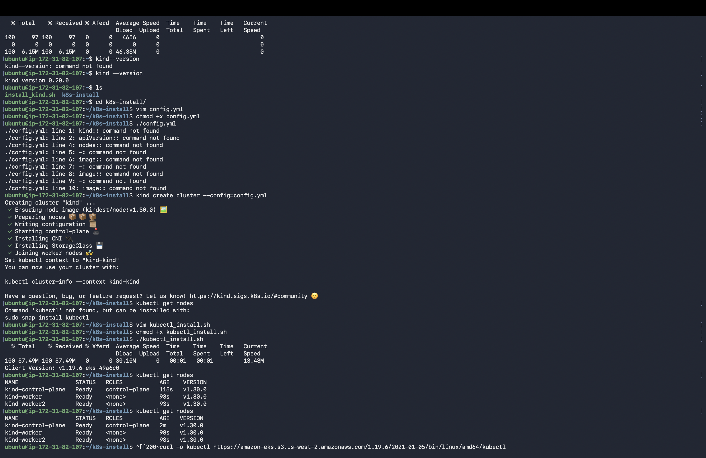
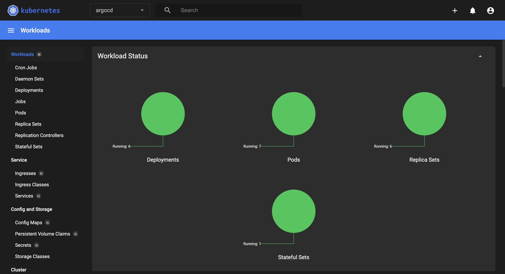
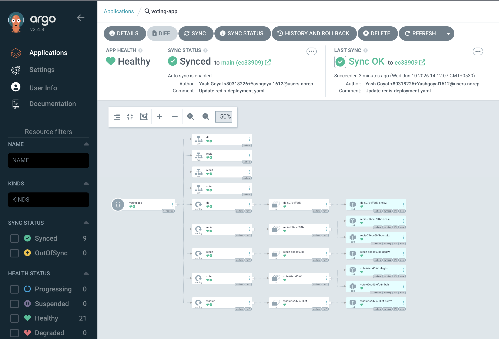
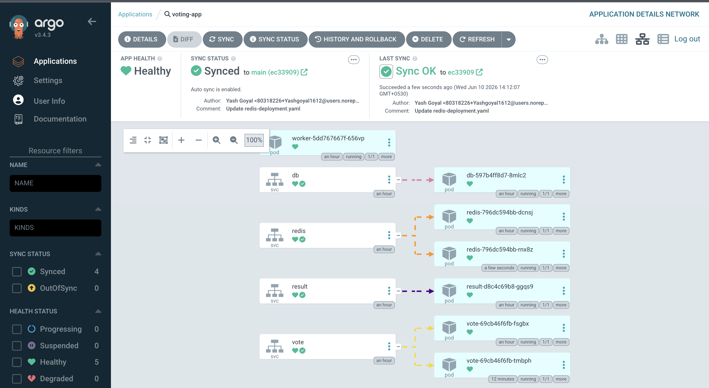
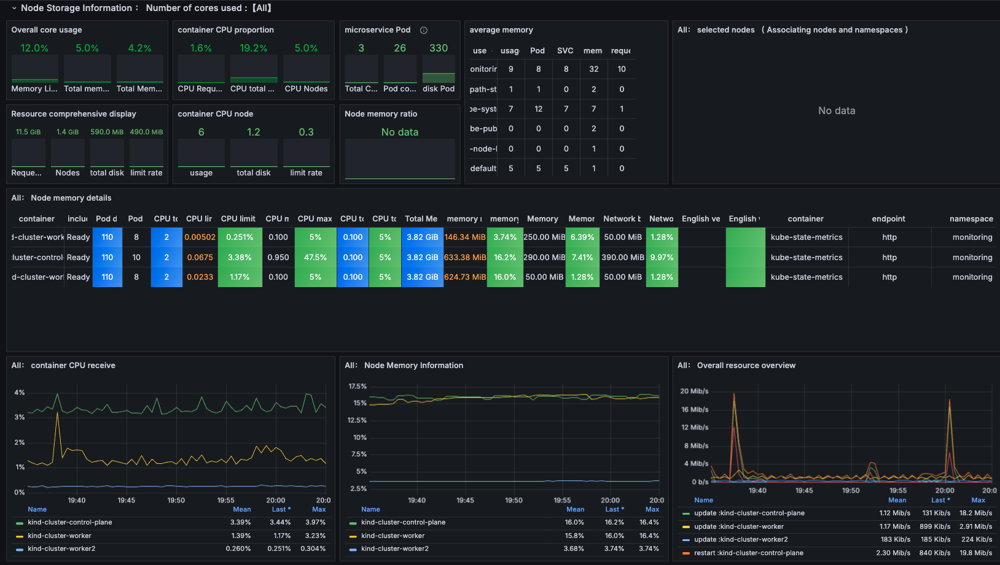

# 🗳️ Kubernetes Voting App — GitOps Deployment with Kind, Argo CD & Prometheus/Grafana

> A production-style, **microservices voting application** deployed on a multi-node **Kubernetes** cluster (provisioned with **Kind** on **AWS EC2**), delivered through a **GitOps continuous-delivery pipeline using Argo CD**, and fully **observable via Prometheus & Grafana**.

<p align="left">
  
  
  
  
  
  
  
  
</p>

---

## 📌 At a Glance (for Recruiters & Hiring Managers)

This project demonstrates **hands-on, end-to-end DevOps and Cloud engineering** skills — exactly the workflow used by modern platform teams:

| Area | What I Built / Demonstrated |
|------|-----------------------------|
| ☁️ **Cloud** | Provisioned and operated infrastructure on **AWS EC2** |
| ⚙️ **Container Orchestration** | Stood up a **3-node Kubernetes cluster** (1 control-plane + 2 workers) using **Kind** |
| 🚀 **GitOps / CD** | Automated, self-healing deployments with **Argo CD** (auto-sync, drift detection, Git as the single source of truth) |
| 🐳 **Containers** | Built & ran **5 polyglot microservices** (Python, .NET, Node.js, Redis, Postgres) |
| 📦 **CI** | **GitHub Actions** multi-arch Docker image build/push pipelines (amd64/arm64/arm-v7) |
| 📊 **Observability** | Cluster & app monitoring with the **kube-prometheus-stack** (Prometheus + Grafana) deployed via **Helm** |
| 🛠️ **Kubernetes Resources** | Authored Deployments, Services, replica scaling, health checks, and a K8s Dashboard with RBAC tokens |
| 📜 **IaC / Automation** | Shell-scripted, repeatable cluster + tooling installation |

**Outcome:** A fully automated GitOps workflow where a `git push` to the manifests repo is automatically detected and synced to the live cluster by Argo CD — **zero manual `kubectl apply`** in steady state.

---

## 🏗️ Architecture

The application is a classic distributed microservices system. A user casts a vote, which flows through a Redis queue, is processed by a background worker, persisted to Postgres, and the live tally is streamed back to a results dashboard.


### Components

| Service | Tech | Role |
|---------|------|------|
| **vote** | Python (Flask) | Front-end web app to cast a vote between two options |
| **redis** | Redis | In-memory queue that collects incoming votes |
| **worker** | .NET (C#) | Consumes votes from Redis and writes them to Postgres |
| **db** | PostgreSQL | Durable storage for vote results (backed by a volume) |
| **result** | Node.js | Real-time results dashboard (Socket.IO live updates) |

---

## 🔁 GitOps Workflow

```
   Developer                GitHub Repo              Argo CD                 Kind Cluster (AWS EC2)
  ┌─────────┐   git push   ┌────────────┐  watches  ┌──────────┐  auto-sync ┌────────────────────┐
  │  edit    │ ──────────► │ k8s-specs/ │ ◄──────── │  detects │ ─────────► │ vote / redis / db  │
  │ manifest │             │  *.yaml    │           │   drift  │            │ worker / result    │
  └─────────┘             └────────────┘           └──────────┘            └────────────────────┘
```

- **Git is the source of truth** — every change to a Kubernetes manifest is version-controlled.
- **Argo CD auto-sync** continuously reconciles the live cluster state with the Git repo.
- **Self-healing** — manual drift in the cluster is automatically reverted to match Git.

---

## 📸 Project Showcase

### 1. Cluster Provisioning — Kind + kubectl on AWS EC2
A 3-node Kubernetes cluster (`kind-control-plane`, `kind-worker`, `kind-worker2`) created from a declarative `config.yml`, all nodes `Ready` on Kubernetes **v1.30.0**.



### 2. Kubernetes Dashboard — Workload Overview
The built-in Kubernetes Dashboard showing healthy workloads (Deployments, Pods, ReplicaSets, StatefulSets) running in the cluster.



### 3. Argo CD — Application Resource Tree
The `voting-app` application **Synced** and **Healthy** in Argo CD, with auto-sync enabled. The resource tree visualizes every Deployment → ReplicaSet → Pod and Service managed declaratively from Git.



### 4. Argo CD — Network / Detailed View
Network topology view in Argo CD mapping Services to their backing Pods, all reporting `Healthy` and `running`.



### 5. Observability — Prometheus & Grafana
Cluster and application metrics (CPU, memory, network I/O) scraped by Prometheus and visualized in Grafana, deployed via the `kube-prometheus-stack` Helm chart.




---

## 🧰 Tech Stack

**Cloud & Infra:** AWS EC2 · Linux (Ubuntu)
**Orchestration:** Kubernetes 1.30 · Kind (Kubernetes-in-Docker) · kubectl
**GitOps / CD:** Argo CD (auto-sync, self-healing, drift detection)
**CI:** GitHub Actions (multi-arch Docker builds → Docker Hub & GHCR)
**Containers:** Docker · Docker Compose · Docker Swarm stack
**Packaging:** Helm
**Monitoring:** Prometheus · Grafana · Alertmanager · node-exporter
**Languages (app):** Python · C# (.NET) · Node.js · SQL (Postgres) · Redis

---

## 📂 Repository Structure

```
kind-voting-app-k8s/
├── k8s-specifications/        # Kubernetes manifests (Deployments + Services) — the GitOps source
│   ├── vote-deployment.yaml   # synced & managed by Argo CD
│   ├── redis-deployment.yaml
│   ├── worker-deployment.yaml
│   ├── db-deployment.yaml
│   ├── result-deployment.yaml
│   └── *-service.yaml
├── kind-cluster/              # Cluster bootstrap
│   ├── config.yml             # 3-node Kind cluster definition
│   ├── install_kind.sh        # automation scripts
│   ├── install_kubectl.sh
│   ├── dashboard-adminuser.yml
│   └── commands.md            # full runbook of all setup commands
├── .github/workflows/         # CI: multi-arch Docker build pipelines
├── vote/                      # Python (Flask) voting front-end
├── worker/                    # .NET (C#) background processor
├── result/                    # Node.js real-time results app
├── healthchecks/              # Postgres & Redis health probes
└── seed-data/                 # Vote generation / load utilities
```

---

## 🚀 How to Run It Yourself

> Prerequisites: an AWS EC2 instance (or any Linux host) with Docker installed.

### 1. Install Kind & kubectl
```bash
cd kind-cluster
chmod +x install_kind.sh install_kubectl.sh
./install_kind.sh
./install_kubectl.sh
```

### 2. Create the 3-node Kubernetes cluster
```bash
kind create cluster --config=config.yml
kubectl get nodes          # control-plane + 2 workers, all Ready
```

### 3. Install Argo CD
```bash
kubectl create namespace argocd
kubectl apply -n argocd -f https://raw.githubusercontent.com/argoproj/argo-cd/stable/manifests/install.yaml
kubectl patch svc argocd-server -n argocd -p '{"spec": {"type": "NodePort"}}'
kubectl port-forward -n argocd service/argocd-server 8443:443 --address=0.0.0.0 &

# Get the initial admin password
kubectl get secret -n argocd argocd-initial-admin-secret -o jsonpath="{.data.password}" | base64 -d && echo
```

Then in the Argo CD UI, create an **Application** pointing at this repo's `k8s-specifications/` path and enable **auto-sync**.

### 4. (Optional) Install the Kubernetes Dashboard
```bash
kubectl apply -f https://raw.githubusercontent.com/kubernetes/dashboard/v2.7.0/aio/deploy/recommended.yaml
kubectl -n kubernetes-dashboard create token admin-user
```

### 5. Install monitoring (Prometheus + Grafana via Helm)
```bash
helm repo add prometheus-community https://prometheus-community.github.io/helm-charts
helm repo update
kubectl create namespace monitoring
helm install kind-prometheus prometheus-community/kube-prometheus-stack \
  --namespace monitoring \
  --set prometheus.service.nodePort=30000 --set prometheus.service.type=NodePort \
  --set grafana.service.nodePort=31000 --set grafana.service.type=NodePort
```

> 📖 The complete, step-by-step command runbook is in [`kind-cluster/commands.md`](kind-cluster/commands.md).

---

## 💡 Key Skills Demonstrated

- **GitOps mindset** — declarative infrastructure, Git as source of truth, automated reconciliation.
- **Kubernetes fundamentals** — Deployments, Services, ReplicaSets, scaling, health checks, namespaces, RBAC.
- **CI/CD pipelines** — automated multi-architecture container builds with GitHub Actions.
- **Observability** — metrics collection, dashboards, and PromQL queries for CPU/memory/network.
- **Infrastructure automation** — repeatable, scripted environment setup.
- **Cloud operations** — running and exposing workloads on AWS EC2.

---

## 📄 Resume One-Liner

> Designed and deployed a multi-node Kubernetes (Kind) cluster on AWS EC2 running a 5-service polyglot microservices application, automated continuous delivery with **Argo CD GitOps** (auto-sync & self-healing), built **multi-arch CI pipelines** with GitHub Actions, and implemented full-stack observability with **Prometheus & Grafana** via Helm.

---

## 🙏 Acknowledgements

- Base application: [Docker Example Voting App](https://github.com/dockersamples/example-voting-app)
- DevOps guidance: [TrainWithShubham](https://www.trainwithshubham.com/)

---

### 👤 Author

**Yash Goyal** — [GitHub: @Yashgoyal1612](https://github.com/Yashgoyal1612)
*Aspiring DevOps / Cloud Engineer*
